# Site Architecture — Centaurion.me
*April 2026 · Skill: site-architecture · Author: Malik Palamar*

---

## Page Hierarchy (ASCII Tree)

```
Homepage (/)
├── Methodology (/methodology)
│   ├── Three Laws (/methodology/three-laws)
│   ├── Fitness Equation (/methodology/fitness-equation)
│   ├── Five Sensing Layers (/methodology/sensing-layers)
│   ├── The Exo-Cortex (/methodology/exo-cortex)
│   └── Active Inference Loop (/methodology/active-inference-loop)
├── Agentic Engineering (/agentic-engineering)
│   ├── Level 1 — Tab Complete (/agentic-engineering/level-1-tab-complete)
│   ├── Level 2 — Chat-Driven (/agentic-engineering/level-2-chat-driven)
│   ├── Level 3 — Context-Loaded (/agentic-engineering/level-3-context-loaded)
│   ├── Level 4 — Compounding Sessions (/agentic-engineering/level-4-compounding-sessions)
│   ├── Level 5 — MCP-Connected (/agentic-engineering/level-5-mcp-connected)
│   ├── Level 6 — Harnessed Agents (/agentic-engineering/level-6-harnessed-agents)
│   ├── Level 7 — Background Agents (/agentic-engineering/level-7-background-agents)
│   ├── Level 8 — Multi-Agent Orchestration (/agentic-engineering/level-8-multi-agent)
│   ├── Level 9 — Autonomous Deployment (/agentic-engineering/level-9-autonomous-deployment)
│   ├── Level 10 — Simulation-First (/agentic-engineering/level-10-simulation-first)
│   └── Level 11 — Physical-Digital Bridge (/agentic-engineering/level-11-physical-digital)
├── Work With Us (/work-with-us)
│   ├── Fractional CAO (/work-with-us/fractional-cao)
│   ├── AI Transformation Advisory (/work-with-us/ai-transformation)
│   └── Workshops (/work-with-us/workshops)
├── Case Studies (/case-studies)
│   └── Alchemy of Breath (/case-studies/alchemy-of-breath)
├── Glossary (/glossary)
│   ├── Free Energy Principle (/glossary/free-energy-principle)
│   ├── Markov Blanket (/glossary/markov-blanket)
│   ├── Active Inference (/glossary/active-inference)
│   ├── Prediction Error (/glossary/prediction-error)
│   ├── Exo-Cortex (/glossary/exo-cortex)
│   └── [20+ additional terms]
├── Blog (/blog)
│   ├── [Category: Methodology] (/blog/category/methodology)
│   ├── [Category: Agentic Engineering] (/blog/category/agentic-engineering)
│   ├── [Category: AI Strategy] (/blog/category/ai-strategy)
│   └── [Category: Case Studies] (/blog/category/case-studies)
├── About (/about)
│   └── Malik Palamar (/about/malik-palamar)
└── Contact (/contact)

[Legal — Footer only]
├── Privacy Policy (/privacy)
└── Terms (/terms)
```

---

## Visual Sitemap (Mermaid)

```mermaid
graph TD
    subgraph Header Nav
        HOME[Homepage /]
        METHOD[Methodology]
        AGENT[Agentic Engineering]
        WORK[Work With Us]
        BLOG[Blog]
        CTA[Get Started]
    end

    subgraph Footer Nav
        ABOUT[About / Malik]
        CASES[Case Studies]
        GLOSS[Glossary]
        CONTACT[Contact]
        PRIVACY[Privacy]
        TERMS[Terms]
    end

    HOME --> METHOD
    HOME --> AGENT
    HOME --> WORK
    HOME --> BLOG
    HOME --> CASES

    METHOD --> M1[Three Laws]
    METHOD --> M2[Fitness Equation]
    METHOD --> M3[Five Sensing Layers]
    METHOD --> M4[Exo-Cortex]
    METHOD --> M5[Active Inference Loop]

    AGENT --> A1[Levels 1-8]
    AGENT --> A2[Level 9 — Autonomous Deployment]
    AGENT --> A3[Level 10 — Simulation-First]
    AGENT --> A4[Level 11 — Physical-Digital]

    WORK --> W1[Fractional CAO]
    WORK --> W2[AI Transformation]
    WORK --> W3[Workshops]

    CASES --> C1[Alchemy of Breath]

    BLOG --> B1[Methodology]
    BLOG --> B2[Agentic Engineering]
    BLOG --> B3[AI Strategy]
```



---

## URL Map Table

| Page | URL | Parent | Nav Location | Priority |
|---|---|---|---|---|
| Homepage | `/` | — | Header (logo) | P0 |
| Methodology Hub | `/methodology` | Homepage | Header | P0 |
| Three Laws | `/methodology/three-laws` | Methodology | Header dropdown | P1 |
| Fitness Equation | `/methodology/fitness-equation` | Methodology | Header dropdown | P1 |
| Five Sensing Layers | `/methodology/sensing-layers` | Methodology | Header dropdown | P1 |
| Exo-Cortex | `/methodology/exo-cortex` | Methodology | Header dropdown | P1 |
| Active Inference Loop | `/methodology/active-inference-loop` | Methodology | Header dropdown | P2 |
| Agentic Engineering Hub | `/agentic-engineering` | Homepage | Header | P0 |
| Levels 1–11 (×11) | `/agentic-engineering/level-[n]-[slug]` | Agentic Eng. | Hub page links | P1 |
| Work With Us | `/work-with-us` | Homepage | Header | P0 |
| Fractional CAO | `/work-with-us/fractional-cao` | Work With Us | Header dropdown | P1 |
| AI Transformation | `/work-with-us/ai-transformation` | Work With Us | Header dropdown | P1 |
| Workshops | `/work-with-us/workshops` | Work With Us | Header dropdown | P2 |
| Case Studies Hub | `/case-studies` | Homepage | Footer + Blog CTA | P1 |
| AOB Case Study | `/case-studies/alchemy-of-breath` | Case Studies | Case Studies hub | P1 |
| Glossary Hub | `/glossary` | Homepage | Footer + Blog links | P1 |
| Glossary Terms (×20+) | `/glossary/[term-slug]` | Glossary | Hub + blog links | P2 |
| Blog Hub | `/blog` | Homepage | Header | P1 |
| Blog Posts | `/blog/[slug]` | Blog | Blog hub | P2 |
| About | `/about` | Homepage | Footer | P2 |
| Malik Palamar Bio | `/about/malik-palamar` | About | Footer + bylines | P2 |
| Contact | `/contact` | Homepage | Footer + CTA | P2 |
| Privacy Policy | `/privacy` | — | Footer | P3 |
| Terms | `/terms` | — | Footer | P3 |

---

## Navigation Spec

### Header Nav (ordered left → right)

```
[Logo] · Methodology · Agentic Engineering · Work With Us · Blog · [Work With Us CTA →]
```

**Dropdown — Methodology:**
- The Three Laws
- Fitness Equation
- Five Sensing Layers
- The Exo-Cortex

**Dropdown — Agentic Engineering:**
- Overview (hub page)
- Levels 1–8 (group link)
- Level 9: Autonomous Deployment
- Level 10: Simulation-First
- Level 11: Physical-Digital Bridge

**Dropdown — Work With Us:**
- Fractional CAO
- AI Transformation Advisory
- Workshops

**CTA Button**: `Work With Us →` (links to `/work-with-us`)

---

### Footer Sections

**Methodology**
- The Three Laws
- Fitness Equation
- Five Sensing Layers
- The Exo-Cortex

**Engineering**
- Agentic Engineering Overview
- 11 Levels Framework (GitHub)
- Level 9: Autonomous Deployment

**Work**
- Fractional CAO
- AI Transformation
- Workshops
- Case Studies

**Resources**
- Blog
- Glossary
- About Malik
- Contact

**Legal**
- Privacy Policy
- Terms

---

### Breadcrumb Implementation

Every page below L1 displays breadcrumbs:

| URL | Breadcrumb |
|---|---|
| `/methodology/three-laws` | Home > Methodology > Three Laws |
| `/agentic-engineering/level-9-autonomous-deployment` | Home > Agentic Engineering > Level 9 |
| `/blog/slug` | Home > Blog > [Post Title] |
| `/glossary/free-energy-principle` | Home > Glossary > Free Energy Principle |
| `/case-studies/alchemy-of-breath` | Home > Case Studies > Alchemy of Breath |

Add `BreadcrumbList` JSON-LD schema on all breadcrumb pages (see `strategy/schema-markup.md`).

---

## Internal Linking Plan

### Hub-and-Spoke Structure

**Hub 1: `/methodology`**
- Spokes: Three Laws, Fitness Equation, Sensing Layers, Exo-Cortex, Active Inference Loop
- Each spoke links back to hub and cross-links to related spokes
- All blog posts tagged "methodology" link back to hub

**Hub 2: `/agentic-engineering`**
- Spokes: All 11 level pages
- Each level page links to previous/next level (sequential navigation)
- Level 9–11 pages (Palamar extensions) cross-link to Methodology hub

**Hub 3: `/glossary`**
- Spokes: Individual term definition pages
- Every use of a glossary term in blog/methodology pages links to its `/glossary/[term]` page
- Glossary terms link back to the methodology page where they're explained in depth

### Cross-Section Linking Rules

| From | To | Anchor Text Pattern |
|---|---|---|
| Methodology pages | Case Studies | "See this in action: [AOB Case Study]" |
| Agentic Engineering levels | Work With Us | "Ready to implement Level [N]?" |
| Blog posts | Methodology hub | "The full framework: The Centaurion Method" |
| Glossary terms | Blog posts | "Deep dive: [related post title]" |
| Case Studies | Work With Us | "Start your transformation →" |

### Orphan Page Prevention

Every new page published must have at minimum:
1. One link from a hub page or parent section
2. One breadcrumb chain back to homepage
3. One contextual mention in a blog post or related page

---

## Key Design Decisions

**Why `/methodology` not `/framework` or `/approach`**: "Methodology" is the search-intent match for the target buyer (CAO-level, enterprise buyers search for methodology). It also mirrors academic/consulting authority signals.

**Why `/agentic-engineering` not `/blog/agentic-engineering`**: The 11 Levels are IP, not content. They deserve a permanent top-level section that survives editorial calendar changes and signals product-level stability.

**Why `/glossary` as top-level**: Owned vocabulary is the long-term SEO moat. Terms like "exo-cortex," "prediction error routing," and "fitness landscape" should have Centaurion as the reference definition. Top-level placement signals canonical authority.

**Why no `/services`**: "Services" signals freelancer/agency. "Work With Us" signals partnership and is outcome-oriented — consistent with Centaurion's positioning as advisory methodology, not a service provider.
